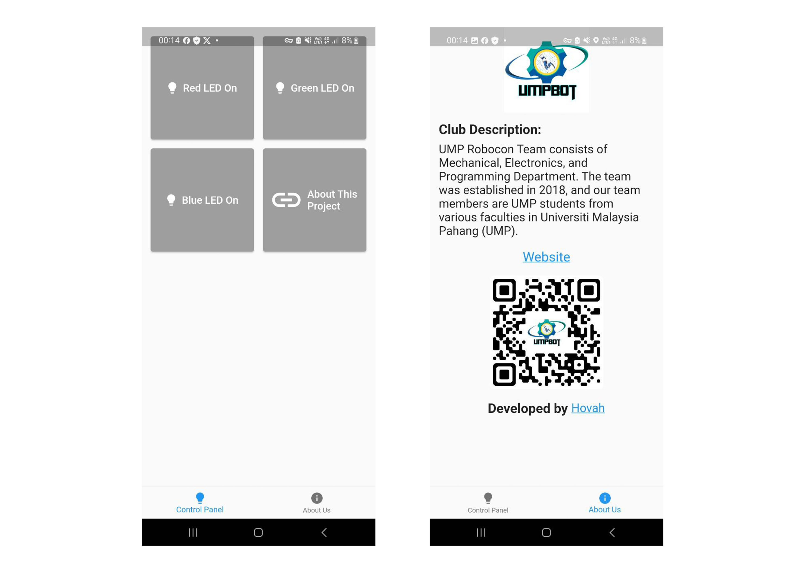

# UMPBot - LED Control with Flutter App and ESP32

## Mobile Application


## Project Demostration 


## Overview

UMPBot is an application that enables you to control LED lights using a Flutter app and an ESP32 microcontroller. This project demonstrates how to control individual LED lights remotely over a Wi-Fi connection. The Flutter app provides a user-friendly interface to toggle the state of the LEDs.

## Features

- Control Red, Green, and Blue LEDs individually.
- Toggle the LEDs on and off remotely.
- User-friendly interface with responsive design.
- Easily customizable and expandable for other features.

## Prerequisites

Before you get started, ensure you have the following:

- Flutter Development Environment: [Flutter Installation Guide](https://flutter.dev/docs/get-started/install)
- ESP32 Microcontroller: [ESP32 Getting Started Guide](https://docs.espressif.com/projects/esp-idf/en/latest/esp32/get-started/)
- Basic knowledge of Flutter and ESP32 programming.

## Getting Started

1. Clone this repository:
   ```shell
   git clone https://github.com/hovahyii/LED-Control-with-Flutter-App-and-ESP32.git
   ```

2. Set up the Flutter app:
- Navigate to the flutter_app directory.
- Modify the app to suit your needs or use it as a reference for your projects.

3. Set up the ESP32:
- Program your ESP32 with the code provided in the esp32_code directory.
- Customize the ESP32 code to match your LED setup.
  ```shell
  flutter run
   ```
4. Run the Flutter app:
- Connect your Flutter-compatible device or emulator.
- Run the app using the command:

5. Enjoy controlling your LEDs remotely!

## Troubleshooting

If you encounter issues while setting up or running the project, check the troubleshooting section in the app and ESP32 code for solutions. Ensure your device and ESP32 are connected to the same network.

## Contributions

Contributions to this project are welcome. Feel free to submit issues, suggest improvements, or create pull requests.

## License

This project is licensed under the MIT License. See the LICENSE file for details.

## Acknowledgments

For any questions or feedback, please reach out to the project author, [Hovah](https://hovahyii.vercel.app).

Happy LED controlling!


### Like this project? You can show your appreciation by buying Hovah a coffee ☕

<a target="_blank" rel="noopener noreferrer" href="https://www.buymeacoffee.com/hovahyii"></a>


